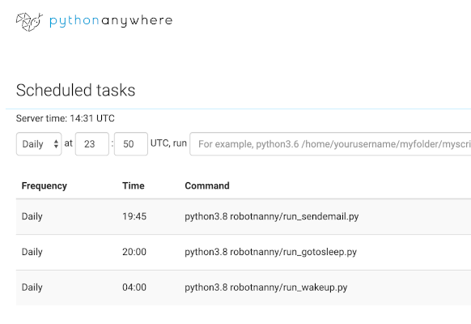

# https://github.com/pj-laakkonen/robotnanny
# RobotNanny 0.1.1
# Author Petri Laakkonen
# petri@laakkonen.io

RobotNanny
- blocks / opens the mobile data in Finland and abroad at the set time
- sends an email as a reminder to go to bed

Tech: Python, Selenium

Mobile operator: https://elisa.fi/

# My case
- Used Task Scheduler: https://www.pythonanywhere.com
- Sends an email as a reminder to go to bed at 22:45 (19:45 GMT)
- Blocks mobile data in the evening at 23 (20:00 GMT)
- Blocks will be removed in the morning at 7 (04:00 GMT)

